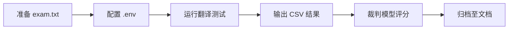

# 指南

TransBench 是一套用于评估大模型中英互译能力的基准测试工具。本指南涵盖环境配置、运行方式与评分标准。

## 文档导航

- [快速入门](/guide/getting-started) — 环境准备与运行测试
- [评分标准](/guide/scoring) — 五维评分体系与质量等级
- [需求文档](/guide/requirements) — 完整功能与技术规格

## 工作流程

